# 浙考申论智阅 · 产品需求文档（PRD）

| 项目 | 内容 |
|---|---|
| 版本 | V2.0（按当前实现重写；V1.0 为立项设计稿） |
| 日期 | 2026-09-29 |
| 适用范围 | 浙江省公务员录用考试《申论》A / B / C 卷 |
| 配套文档 | [需求分析](需求分析.md) · [流程图](流程图.md) · [需求修订说明](需求修订说明.md) |
| 状态标记 | ✅ 已实现　◐ 部分实现　○ 未实现（后续版本） |

---

## 1 产品概述

### 1.1 定位

面向浙江省考申论备考者的 AI 批改智能体：**不只给分，还要说明分数怎么来的、最该改哪里，以及修改后是否真的学会了。**

一句话流程：选卷 → 作答（在线或拍照） → 证据化批改 → 分层提示与二次修改 → 学习画像 → 训练处方与换题复测。

### 1.2 核心价值

| 用户痛点 | 产品做法 |
|---|---|
| 人工批改贵、等得久 | 单题约 40—70 秒出结果，整卷各题并行 |
| AI 分数不可信 | 评分账本：每个得分点都有「材料依据 → 你的原文 → 判断」；引用必须真实出现在答案里 |
| 只知道错，不知道为什么错 | 失分因果诊断（如「只写了做什么 → 没写谁来做、怎么做 → 对策缺少可操作性」） |
| 不知道先改哪 | 反事实增分：按「预计增分 ÷ 耗时」排序 |
| 看完答案就以为会了 | 默认不给参考答案，四级提示逐级解锁；换主题复测 |
| 真题练完了 | AI 按真题结构出模拟卷 |

### 1.3 产品边界

- 所有分数都是**模拟评分**，每份报告固定显示：「模拟评分，仅供训练参考，不等同于正式考试分数，也不代表与阅卷结果一致。」
- 浙江省考不公开阅卷细则。系统里的评分配置统一称「教研评分配置」或「AI 生成评分点」，界面不出现「官方评分标准」。
- 不承诺提分，不说「保证上岸」。

---

## 2 浙江省考申论

### 2.1 试卷类别

| 卷别 | 考试类别 | 适用职位 | 笔试科目 |
|---|---|---|---|
| A | 综合类 | 县级以上机关（不含行政执法类） | 行测 A + 申论 A |
| B | 基层类 | 乡镇（街道）机关（不含村干部职位） | 行测 B + 申论 B |
| C | 行政执法类 | 公安执勤、司法警察、综合执法、市场监管、生态环保等一线执法职位 | 行测 C + 申论 C |
| D | 村干部类 | 乡镇（街道）面向村干部的职位 | 行测 D + 《综合应用能力》，**不考申论，不收录** |

来源：[华图教育整理的浙江省考公告考试类别](https://www.huatu.com/2023/0831/2682260.html)，每年以当年公告为准。

### 2.2 试卷结构（据题库 11 套真题归纳）

满分 100 分，时限 150 分钟，由「给定资料」与「作答要求」两部分组成。2023—2026 年度 11 套卷**全部是三道题、20 / 30 / 50 分**：

| 题号 | 分值 | 题型（11 套中的出现次数） | 常见字数 |
|---|---|---|---|
| 第 1 题 | 20 | 应用文 5 · 归纳概括 5 · 提出对策 1 | ≤300 |
| 第 2 题 | 30 | 应用文（多为短评）10 · 综合分析 1 | ≤500—600 |
| 第 3 题 | 50 | 大作文 11 | 1000—1200 |

给定资料 4—10 则，约 5000—7700 字。考试一般在前一年 11—12 月举行（「2026 年度」在 2025 年 12 月）。

---

## 3 用户与场景

| 角色 | 特征 | 主要场景 |
|---|---|---|
| 基础备考者 | 不熟悉题型，容易摘抄材料 | 在线作答 → 看评分账本理解得分点 → 逐级看提示修改 |
| 中等水平考生 | 分数卡在中段，同类错误反复出现 | 看错误模式库 → 按训练处方练 → 换主题复测 |
| 冲刺考生 | 时间紧，要整卷练 | 整卷作答或拍照上传 → 只看「先改哪里最划算」 |
| 教师 | 需要处理争议和低置信度结果 | 复核队列逐点改判，给出最终分 |

核心用户故事：

1. 我想在题库里选一套近年真题，一边看资料一边作答，在资料上划重点。
2. 我在纸上写完整卷，希望拍几张照片上传，系统自己分出每道题的答案。
3. 我想知道每一处扣分对应哪条材料，以便判断 AI 批得对不对；不对我要能申诉。
4. 真题做完了，我想要一套结构和浙江卷一样的新题。
5. 我想把试卷导出成 PDF 打印出来，在纸上写。
6. 我想问「2025 年 B 卷考了什么」「对策题怎么写不空泛」，得到有出处的回答。

---

## 4 功能范围

| 模块 | 说明 | 状态 |
|---|---|---|
| M1 账号与目标 | 注册登录、学员 / 教师角色、备考目标、隐私设置 | ✅ |
| M2 题库 | 真题 A/B/C 卷、AI 模拟卷，按年度与卷别浏览 | ✅ |
| M3 导入真题 | 粘贴整卷文本，规则切分入库 | ✅ |
| M4 AI 出题 | 按同卷别真题结构生成模拟卷 | ✅ |
| M5 答卷 | 整卷 / 部分题；在线作答或拍照上传；质量检测；识别与分题 | ✅ |
| M6 资料标记 | 作答时在资料上高亮、下划线 | ✅ |
| M7 批改 | 评分配置生成、批改智能体、评分账本、红线、置信度 | ✅ |
| M8 修改与复评 | 分层提示、二次修改、版本对比 | ✅ |
| M9 学习画像 | 能力维度、错误模式库、训练处方、换题复测 | ✅ |
| M10 申诉与复核 | 评分点申诉、自动重检、教师复核队列 | ✅ |
| M11 申论助手 | 对话式查真题、材料、方法与个人记录 | ✅ |
| M12 导出 PDF | A4 试卷，可带标记与方格答题纸 | ✅ |
| M13 全卷限时模拟 | 计时、时间分配分析、考场能力模型 | ○ |
| M14 评测集 | 教师评分样本库，衡量 AI 与教师评分差异 | ○ |
| M15 班级与机构 | 班级管理、批量批改、私有题库 | ○ |
| M16 移动端 / 小程序、会员付费 | — | ○ |

业务总流程见 [流程图 · 图 1](流程图.md#图-1-业务总流程)。



---

## 5 功能需求

每个模块写「做什么」和「验收标准」。验收标准均有自动化测试或浏览器实测覆盖。

### 5.1 M1 账号与目标

- 用户名 3—32 位字母数字下划线，密码至少 8 位；密码 PBKDF2 加盐哈希，令牌 HMAC 签名、72 小时过期。
- 开放注册只能注册**学员**；教师账号由已有教师在「设置」里创建，防止任何人自封教师查看他人答卷。
- 首次进入首页填写目标：考试年份、类别、目标地区、目标分、当前基础、预计考试时间。
- 隐私设置：是否允许答卷图片发给识别服务；是否允许作答（脱敏后）用于改进评分，默认关闭。

验收：只认 `Authorization: Bearer` 令牌，伪造令牌或 `X-User-Id` 请求头一律 401；用户名不存在与密码错误返回同一句提示。

### 5.2 M2 题库

- 真题按「年度 + 卷别」组织，每套卷记录：类别、主题、考试日期、材料、题目、来源链接。
- 题库页按年度分组；可按卷别筛选；顶部列出已收录年份范围内还缺哪几套。
- AI 模拟卷只对生成者本人（和教师）可见。
- 学员端不返回评分点关键词和参考答案（参考答案走 M8 分层提示第 4 级）。

验收：题库接口响应里不含 `points`、`reference_answer`；他人的模拟卷返回 404。

### 5.3 M3 导入真题

用于把粉笔等网站上的真题补进题库（这些网站需要登录，系统不直接抓取）。

- 粘贴整套卷的文本，选年度与卷别。**按规则切分，不经过模型**：材料和题干必须是原文。
- 资料以「资料1」「【材料2】」「给定资料3：正文…」等标题分隔；题目以「一、」「1.」「第一题」开头；也支持不带题号、以「要求」条目收尾的排版。
- 自动识别每题分值、字数上下限、题型、引用的资料编号；预览里全部可改。
- 保存写入 `backend/app/data/papers/{年度}_{卷别}.json`（随仓库分发）并入库。同年同卷已存在需勾选「替换」；**已有人作答过的卷不能替换**。

验收：题库 11 套真题还原成 3 种排版后切分，材料与题干逐字一致、分值一致。

### 5.4 M4 AI 出题

- 选卷别 A / B / C，可填主题。
- 结构模板取**同卷别最近一年真题**的题型、分值、字数；该卷别还没有真题时用通用结构并提示。
- 先设计材料方案（每则体裁、要点、埋哪些信息点），再**逐则并行撰写**，每则约 1300 字，不足 70% 自动重写。
- 材料用虚构地名人物（「H 市」「张某」），不编造真实领导人讲话、统计数字和政策文号；界面标注「AI 模拟卷，材料为虚构情境」。
- 后台生成，前端轮询进度；每人同时只能生成一套；失败时写明原因，可直接重试。
- 评分点不在出题时生成，第一次批改时走与真题相同的 M7 流程。

验收：实测 A / B / C 三套并发生成全部成功，材料 5 则 5700—6600 字，题型分值与模板一致，生成后可直接批改。流程见 [图 4](流程图.md#图-4-ai-出题langgraph)。

### 5.5 M5 答卷

以「答卷」为单位上传和识别，以「题」为单位批改。流程见 [图 2](流程图.md#图-2-答卷流程)。

- **选卷**：整卷或勾选部分题；也可以不选卷直接上传。
- **在线作答**：左侧给定资料（聚焦某题时只显示该题引用的资料），右侧逐题作答，显示字数与上下限，草稿自动保存在本机。
- **拍照上传**：JPG / PNG / PDF，单文件 ≤10 MB，每份 ≤8 页；按文件头校验类型，文件名随机生成。首次上传前必须**知情同意**（写明图片发给哪个模型服务），不同意只能在线录入。
- **质量检测**（本地完成，图片不出本机）：清晰度、反光、阴影、倾斜、重复页、分辨率、空白页、边缘裁切，按 A—D 分级并定位到页面区域（如「中下部，约 50%—62% 高度」）。D 级禁止识别，C 级需勾选「我已了解风险」。
- **识别与分题**：视觉模型逐行识别，给出置信度、行类型（答案 / 题目 / 草稿）和所属题号；带文字层的 PDF 直接提取。低置信行标黄，原图与文本并排，每行可改文字、类型、题号，可「以下全部归第 N 题」。
- **匹配试卷**：没选卷时，按「答案二字词在各卷材料中的覆盖率」给出前 3 名，用户确认后按题号重新切分。
- **提交**：确认时对答案做隐私脱敏（手机号、身份证号、准考证号、邮箱）；每题建一个作答，并行批改（同时最多 3 道），整卷结果页显示各题分数与合计。
- 原图只经鉴权接口访问，可一键删除（识别文字与批改结果保留）。

验收：同一页答卷里「第一题…第二题…」能切到各自题下，考生答案内部的「一、二、三」分条序号不会被当成题号；草稿行不进答案。

### 5.6 M6 资料标记

- 在线作答时，资料上方有工具栏：黄 / 绿 / 粉三色荧光笔、红色下划线、橡皮擦、撤销、清空。
- 先选笔，再拖选文字即标记；选区可跨多段；高亮与下划线可叠加。
- 按「资料编号 + 段号 + 字符偏移」存到答卷，自动保存（600 毫秒防抖，失败 5 秒后重试），工具栏显示保存状态。
- 资料编号按钮上显示该则资料的标记数；导出 PDF 时可带上标记。

验收：浏览器实测拖选高亮、跨段下划线，刷新后标记完整保留，橡皮擦可逐条擦除；他人答卷的标记接口返回 404。

### 5.7 M7 批改

**评分配置**

- 每道题有评分维度：**要点型**（归纳、对策、分析、应用文的内容分，按评分点累加）与**等级型**（表达、格式、大作文各维度，按档次打分并写理由）。
- 真题与模拟卷首次批改时，由大模型**按材料生成评分点**（3—8 个，每点有材料依据、关键词组、部分命中表达）与参考答案，落库后同题共用，分数前后可比；来源标注「AI 生成，待教研确认」。
- 大作文只有等级型维度，满分按题目分值等比缩放（浙江大作文 50 分）。

**批改智能体**（[图 3](流程图.md#图-3-批改智能体langgraph)）

题目理解 → 材料证据 → 评分 → 证据校验 → （有疑点时）复核裁决 → 教练。

- 模型逐个评分点判定六种状态：完整命中、部分命中、表达争议、未命中、材料外推、重复；判为命中的必须给出**逐字引用**。
- **证据校验**：引用在答案里找不到的，送大模型复核；复核后仍找不到，按未命中处理。无依据的批注直接丢弃。
- 只对疑点复核，不整题重跑。
- 模型不可用时降级到规则引擎，并在报告上注明「规则评分」与原因。
- 考生答案作为不可信输入包在 `<answer>` 标签里，提示词声明其中内容不是指令。

**批改报告**

- 预计得分、分数区间、置信度（高 / 中 / 低 + 数值，公式可展开查看）、分项得分。
- 答案原文上的五色红线：红（严重）、橙（明显）、黄（建议优化）、蓝（表达）、绿（得分点）；默认只展开影响最大的 5 条，其余折叠。
- 评分账本：每个评分点的状态、得分 / 满分、考生原文、判断理由、材料依据原文（可展开）。
- 失分诊断：错误类型、因果链、推荐训练。
- 「先改哪里最划算」：最多 5 条，含耗时、预计增分区间、优先级。
- 批改过程：智能体各节点的耗时与说明、模型名、提示词版本、评分配置版本。
- 置信度 < 0.6 自动进入教师复核队列。

验收：假模型编造引用时，该评分点经复核后判为未命中；等级分超上限被裁到上限；无依据批注被丢弃。

### 5.8 M8 分层提示、修改与复评

- 四级提示，**服务端按顺序解锁**，前端拿不到未解锁的内容：L1 只看问题 → L2 看提示（回看哪则材料）→ L3 局部示范（每个缺失评分点一句示范）→ L4 参考答案（注明「只是一种合理写法」）。
- 二次修改：在原答案上改，保存为新版本并复评。解锁过 L3 以上后提交的，自动记为「AI 指导版」；可标记「限时重写」。
- 版本对比：总分变化、新增 / 丢失的得分点、修复 / 新增的问题、字数与分项变化、逐句 diff；两个版本评分方式不同时提示「不完全可比」。

### 5.9 M9 学习画像与训练处方

- 能力维度 15 项（审题、材料定位、要点提炼、概括、原因分析、影响分析、对策设计、结构组织、分论点设计、论证、语言、格式、字数、时间管理、卷面），按题型得分率滑动更新；规则评分按一半权重计入。
- 错误模式库：错误类型、累计次数、最近 5 次批改中的次数、触发条件、推荐训练、掌握状态。
- 同一错误出现 2 次且没有进行中的处方时，开训练处方：目标、步骤、预计耗时、通过标准、建议复测时间、**同题型换主题的复测题**。
- 复测批改后自动判定通过与否；若原题已改好但复测仍犯同样错误，标注「原题已修复，但迁移到新题失败」。

### 5.10 M10 评分申诉与教师复核

流程见 [图 6](流程图.md#图-6-评分申诉与教师复核)。

- 考生对某个评分点申诉，写理由；理由里用「」括起的原文会被核对是否真在答案里。
- 系统自动重检（原文核对 + 规则重匹配）作参考，申诉一律进教师队列。
- 教师只能看进入过队列的作答，队列里考生身份脱敏为「学员 #编号」。
- 教师逐点改判、给最终分与意见、处理申诉；**AI 原判保留**，作为后续校准数据。

### 5.11 M11 申论助手

- ReAct 智能体，6 个只读工具：查试卷、看试卷（题目与材料原文）、全文搜材料、考试常识、我的学习记录、我的批改详情（[图 5](流程图.md#图-5-申论助手)）。
- 工具绑定当前用户，只能读题库和本人数据；不能批改、改分、改数据。
- 涉及具体试卷、材料的回答必须来自工具结果并注明出处，题库没有就直说；区分「公告规定」与「教研经验」。
- 对话保存在浏览器会话内，发送时带最近 10 轮。

### 5.12 M12 导出 PDF

- 入口：题库卡片、试卷页、作答页资料面板。
- A4 排版：卷头（名称、类别、满分、时限）、注意事项、给定资料、作答要求。
- 选项：带上我的资料标记（从作答页进入时）；附方格答题纸（每题一页、每行 25 格，按字数上限留足 120% 的格子）。
- 使用浏览器「打印 → 另存为 PDF」，高亮与方格线强制打印；文件名默认为试卷名。

验收：实测带标记与方格纸导出 10 页 A4，标记与方格均在。

---

## 6 关键规则与公式

### 6.1 字数

去除空白后的字符数，**含标点**，与申论方格纸占格一致。

- 超上限：每超 50 字扣 1 分，最多扣题目满分的 20%。
- 明显不足：少于下限的 80% 扣 1 分。

### 6.2 分数核算

- 评分点得分比例：完整命中 1、部分命中 0.5、表达争议 0.5、未命中 / 材料外推 / 重复 0。
- 要点维度满分 = 题目满分 − 各等级型维度满分之和；评分点原始分按比例折算到要点满分。
- 总分 = 要点得分 + 等级型得分 − 字数扣分，裁到 [0, 满分]，按 0.5 分取整。

### 6.3 置信度与分数区间

```text
置信度 = 题目匹配系数 × 识别质量系数 × 证据通过率 × 复核一致系数
```

| 因子 | 取值 |
|---|---|
| 题目匹配系数 | 精确匹配 1.0；相似匹配 0.85；仅题型规则 0.6。评分配置由 AI 生成、未经教研确认的，最高 0.85 |
| 识别质量系数 | 在线录入或 PDF 文字层 1.0；拍照识别按低置信行占比从 1.0 线性降到 0.7 |
| 证据通过率 | 模型声称命中且引用真实存在的比例；规则评分固定 0.75（保证规则评分最多到「中」） |
| 复核一致系数 | 未触发复核或复核与初评一致 1.0；不一致 0.8 |

- ≥0.8 为高，0.6—0.8 为中，<0.6 为低（进教师复核队列）。
- 规则评分的大作文，置信度封顶 0.4。
- 分数区间半宽 = 满分 × (1 − 置信度) × 0.3，至少 0.5 分，裁到 [0, 满分]。
- 置信度是系统对本次评分稳定性的**自评**，不是统计意义上的概率。

### 6.4 反事实增分

```text
缺口分   = 评分点满分 − 当前得分
预计增分 ∈ [缺口分 × 0.5, 缺口分]
排序依据 = 预计增分上限 ÷ 预计耗时（未命中 2 分钟，部分命中 1 分钟）
```

字数扣分也作为一条建议参与排序。取前 5 条，前 2 条为「高」优先级。

### 6.5 规则引擎（模型不可用时）

- 评分点关键词组：外层「且」、内层同义词「或」。**所有组必须落在同一句或同段相邻两句里**才算完整命中；部分命中必须命中第一组（核心对象），避免「使用率低」里的「低」被当成「办结率低」。
- 句子级检测：空泛对策（有「加强、提高」而无主体和具体动作）、原文摘抄（连续 15 字与材料相同）、要点重复、口语化、口号式结尾；应用文检查标题、称谓、落款、日期四要素。
- 规则评分只能判断「看得见的」信息，报告明确注明。

---

## 7 数据

实体关系见 [图 9](流程图.md#图-9-数据模型)。

| 表 | 用途 |
|---|---|
| users | 账号、角色、备考目标、知情同意状态 |
| papers / materials / questions | 试卷（来源：真题 / AI 模拟卷 / 示例）、按段存储的材料、题目 |
| rubrics / scoring_points | 版本化的评分配置与评分点（来源、更新时间） |
| sheets / sheet_pages | 答卷（试卷、作答范围、识别行、资料标记）与原图 |
| submissions / answer_versions | 按题拆分的作答与各版本答案 |
| reviews / appeals | 批改结果（账本、批注、置信度因子、执行轨迹）与申诉 |
| error_patterns / ability_records / prescriptions | 学习画像 |

- 真题以 JSON 文件随仓库分发（`backend/app/data/papers/`），启动时幂等导入；格式与卷别说明见该目录 README。
- 旧库升级时自动补列，不删不改已有数据。

---

## 8 系统架构

见 [图 8](流程图.md#图-8-系统架构)。

| 层 | 技术 |
|---|---|
| 前端 | Vue 3 + Vite + TypeScript，单页应用，由后端一并托管 |
| 后端 | FastAPI（异步）+ SQLAlchemy + SQLite |
| 智能体 | LangGraph：批改图、出题图（固定顺序状态图）；申论助手（ReAct） |
| 模型 | 任意 OpenAI 兼容网关。三档：评分 / 出题用中档模型，评分点生成与复核用大模型，拍照识别用视觉模型 |
| 本地能力 | 图像质量检测（Pillow + numpy）、答卷分题、试卷匹配、规则引擎、隐私脱敏、PDF 文字层提取 |

---

## 9 非功能需求

### 9.1 性能（真实模型网关实测）

| 场景 | 实测 |
|---|---|
| 单题批改（含首次生成评分点） | 40—70 秒 |
| 整卷三题并行批改 | 约 70 秒 |
| AI 出题（一套卷） | 70—210 秒，三套并发全部成功 |
| 申论助手一次回答 | 12—18 秒 |
| 拍照识别 | 未用真实答卷照片测过 |

V1.0 设定的「单题基础批改 30 秒内」未达到；批改在后台进行、前端显示进度，可离开页面。

### 9.2 安全与隐私

- 只认 Bearer 令牌，无请求头旁路；教师账号不能自助注册。
- 数据隔离在查询层：学员只能读自己的数据；教师只能读进入过复核队列的作答，且看不到考生身份。
- 图片外发前必须知情同意；发送前缩小并去掉 EXIF；答案文本确认时脱敏。
- 原图只经鉴权接口访问，可一键删除；上传按文件头校验，随机文件名。
- 模型密钥只在服务端 `.env` 或系统环境变量，接口不读写。
- 按单机 / 内网设计：没有登录限流和 HTTPS，公网部署需加反向代理。

### 9.3 可解释性

每个评分结论都要有：判断、理由、材料依据、分数影响、修改建议、置信度。无依据的批注不展示。

### 9.4 可靠性

- 模型调用失败自动重试；结构化输出校验不过则带着错误信息重问；批改降级到规则引擎并注明。
- 长篇中文材料用纯文本输出，避免正文里的英文引号破坏 JSON；解析时也会修正中文之间的英文引号。
- 同一道题的评分点生成加锁，只生成一次；SQLite 写锁等待 30 秒。

### 9.5 可维护性

- 81 个后端自动化测试（规则引擎、分数核算、LangGraph 流程与假模型、质量检测、答卷分题、导入切分、接口端到端与权限）。
- 提示词带版本号，写进每条批改结果。

---

## 10 风险与应对

| 风险 | 影响 | 应对 |
|---|---|---|
| AI 评分不稳定 | 考生被误导 | 证据校验 + 按点复核；置信度与区间；低置信度进教师队列 |
| AI 生成的评分点不准 | 同题所有批改都偏 | 标注「待教研确认」；教师改判保留 AI 原判用于校准；后续由教研替换 |
| 真题文本有错漏 | 材料依据失真 | 双来源交叉核对、附来源链接；支持导入替换 |
| 考生依赖参考答案 | 学不会 | 参考答案放在第 4 级提示；换主题复测 |
| 图片隐私 | 合规风险 | 知情同意、EXIF 去除、文本脱敏、原图可删 |
| 过度承诺 | 用户误解 | 每份报告固定免责声明，不出现「官方」「保证」 |

---

## 11 版本规划

| 版本 | 内容 | 状态 |
|---|---|---|
| V2.0 | 第 4 节 M1—M12 | ✅ 当前 |
| V2.1 | 补齐题库缺口（2026 C 卷、2024 C 卷材料）；建评测集（建议 ≥200 份教师评分答卷）并统计 AI 与教师评分差异 | ○ |
| V2.2 | 全卷限时模拟、时间分配分析 | ○ |
| V3.0 | 教研确认的评分配置、班级与机构、移动端 | ○ |

---

## 附录：相对 V1.0 的主要变化

完整说明见 [需求修订说明](需求修订说明.md)。

1. 试卷配置从「省级 / 市县 / 乡镇机关」改为浙江实际的 **A / B / C 卷**；D 类不考申论。
2. 上传流程从「一次上传一道题」改为**答卷**为单位，识别后按题号切分。
3. 题库收录真题（附来源），不收机构参考答案；评分点由 AI 按材料生成并标注。
4. 定义了置信度、字数、分数区间、增分公式；「题型影响系数」删除。
5. 多模型交叉评分改为「单模型 + 证据校验 + 按点复核」。
6. 新增资料标记、导出 PDF、AI 出题、申论助手、导入真题。
