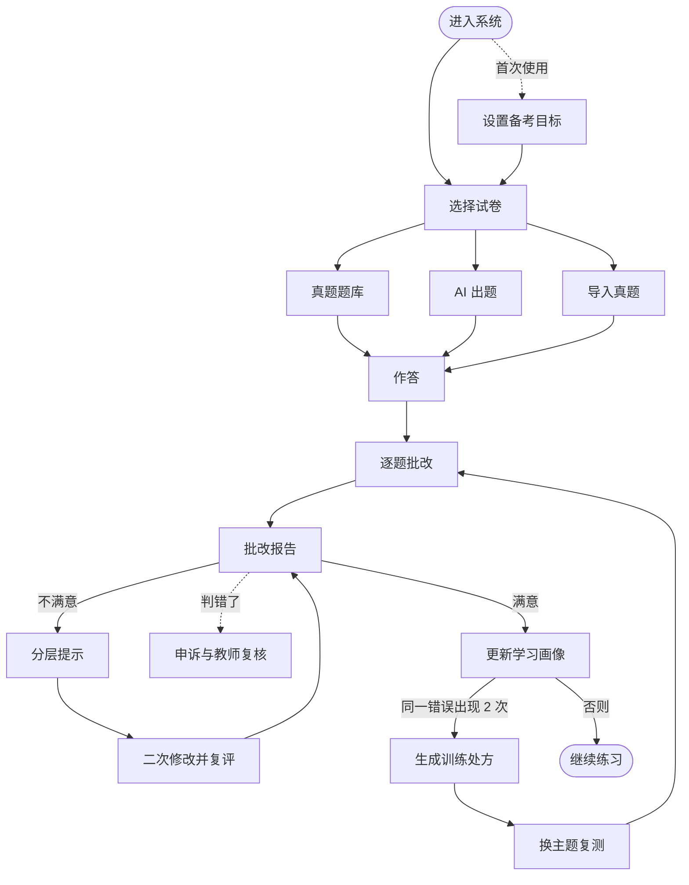
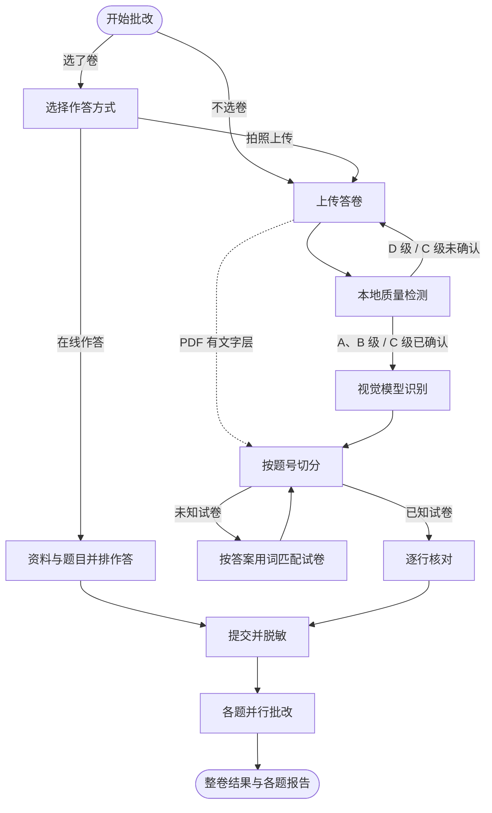
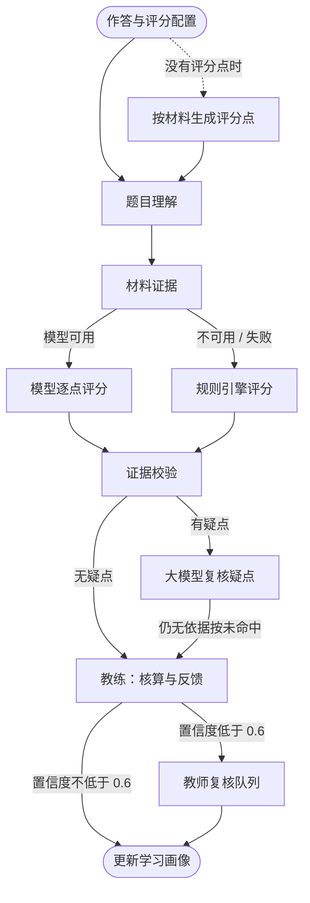
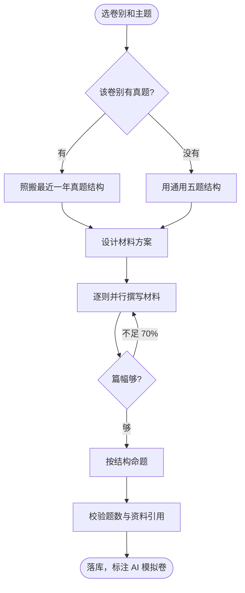
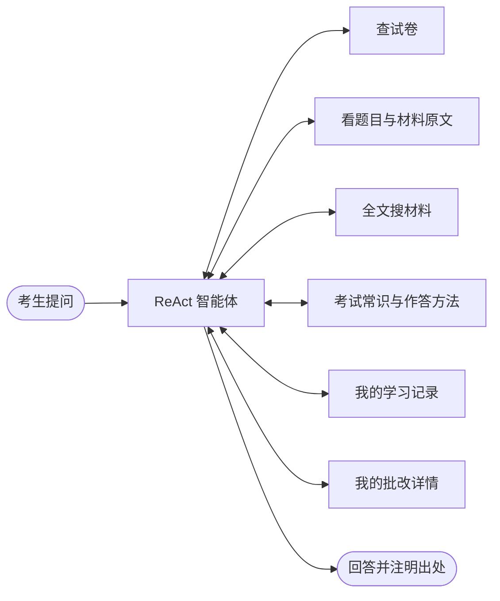
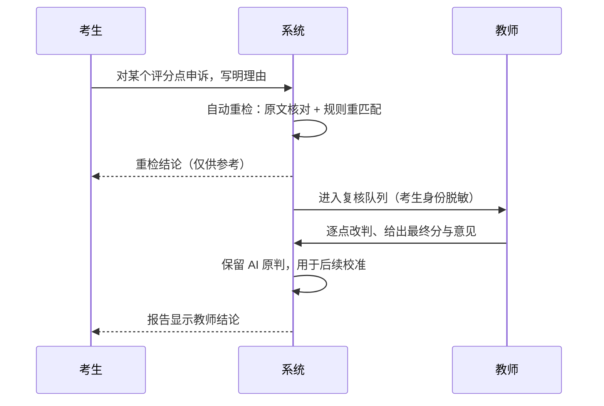
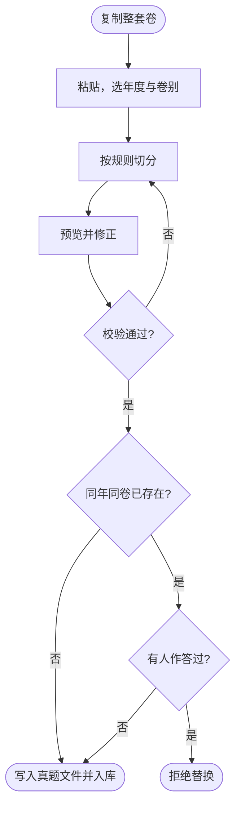
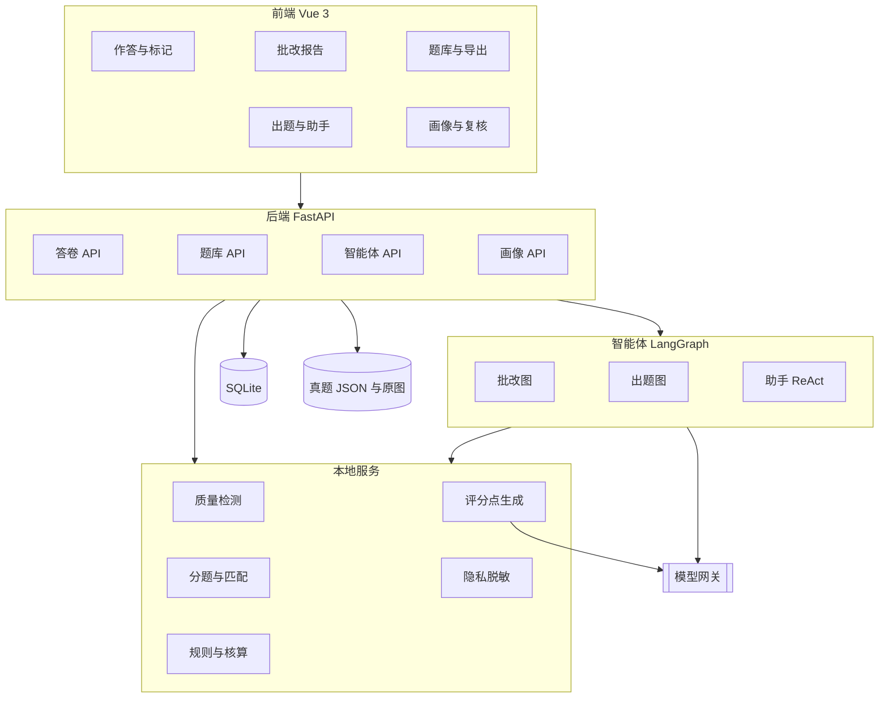
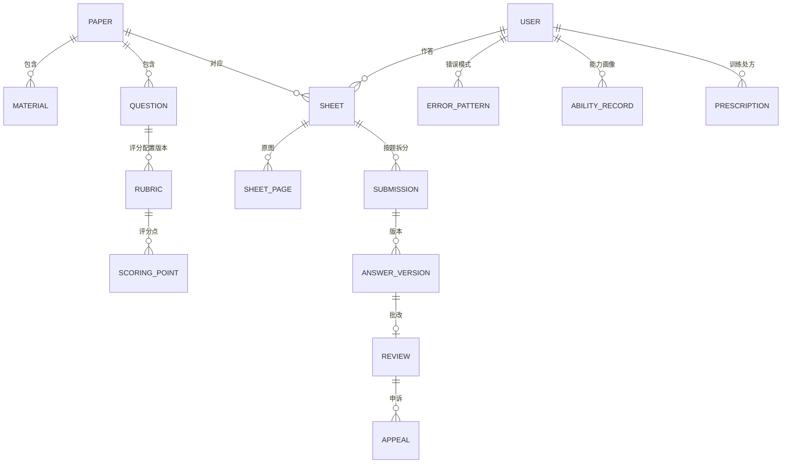

# 浙考申论智阅 · 流程图

版本 V2.0 · 2026-09-29 · 与当前代码一致

本文件是全部流程图的唯一来源。GitHub 上直接渲染；`docs/build` 会把每张图导出为 `docs/diagrams/*.svg`，并连同本文件一起导出 PDF。

## 图 1 业务总流程

考生从选卷到能力提升的完整闭环。

- 真题题库：A 综合类、B 基层类、C 行政执法类。AI 出题按同卷别真题结构生成。导入真题是粘贴整卷文本。
- 作答可以是整卷或部分题，在线作答或拍照上传。
- 批改报告包含评分账本、红线批注、增分建议。分层提示依次为：问题 → 提示 → 局部示范 → 参考答案。
- 学习画像记录能力维度和错误模式。

## 图 2 答卷流程

答题卡一页往往写着几道题，所以上传和识别以「答卷」为单位，批改以「题」为单位。

- **在线作答**：左边资料、右边逐题作答，可以在资料上标记，草稿自动保存。
- **上传**：支持 JPG、PNG、PDF，单文件不超过 10 MB，每份最多 8 页。首次上传前要知情同意，不同意只能在线作答。
- **质量检测**：检查模糊、反光、阴影、倾斜、重复页、分辨率。D 级必须重拍；C 级要勾选「我已了解风险」才能继续。
- **识别**：逐行给出置信度、行类型（答案、题目、草稿），并按答题卡上的题号标出每行属于第几题。
- **匹配试卷**：计算答案用词在各卷材料里的覆盖率，列出前 3 名，由用户确认。
- **逐行核对**：可以改文字、改行类型、改题号，也可以「以下全部归第 N 题」。
- **提交**：确认时脱敏手机号、身份证号、准考证号、邮箱。每题建一个作答，最多 3 道同时批改。

## 图 3 批改智能体（LangGraph）

批改按固定顺序执行。模型只负责判断每个评分点，分数由代码按固定规则算出。

| 节点 | 做什么 |
|---|---|
| 按材料生成评分点 | 第一次批改真题或模拟卷时由大模型生成，保存后同一道题每次都用这份 |
| 题目理解 | 确定题型、评分维度和评分配置的来源 |
| 材料证据 | 把每个评分点的「材料依据」对应到材料原文段落 |
| 模型逐点评分 | 六种状态：完整命中、部分命中、表达争议、未命中、材料外推、重复；判为命中的要逐字引用答案原文 |
| 规则引擎评分 | 关键词必须出现在同一段里才算；另外检查对策空泛、照抄材料、要点重复、口语化 |
| 证据校验 | 引用必须逐字出现在答案里；无依据的批注直接丢弃 |
| 大模型复核疑点 | 只复核有疑点的评分点，不整题重跑 |
| 教练：核算与反馈 | 算分数、置信度，生成批注、失分诊断、增分建议、分层提示 |

## 图 4 AI 出题（LangGraph）

- 照搬的真题结构是题型、分值、字数。
- 材料方案规定每则材料的体裁、写什么、埋哪些信息点。每则约 1300 字，用纯文本输出，地名人物都是虚构的。
- 生成好的模拟卷可以作答、批改、导出 PDF。评分点在第一次批改时生成，和真题一样。

## 图 5 申论助手

只读工具，工具绑定当前用户。

## 图 6 评分申诉与教师复核

## 图 7 导入真题

- 切分只按规则来，不经过模型改写，保证材料和题干都是原文。
- 预览时可以修改每道题的题型、分值、字数上下限和引用的资料。
- 真题文件写入 `backend/app/data/papers/年度_卷别.json`，随仓库一起分发。
- 已经有人作答过的卷不能替换，避免历史批改记录找不到题目。

## 图 8 系统架构

## 图 9 数据模型

